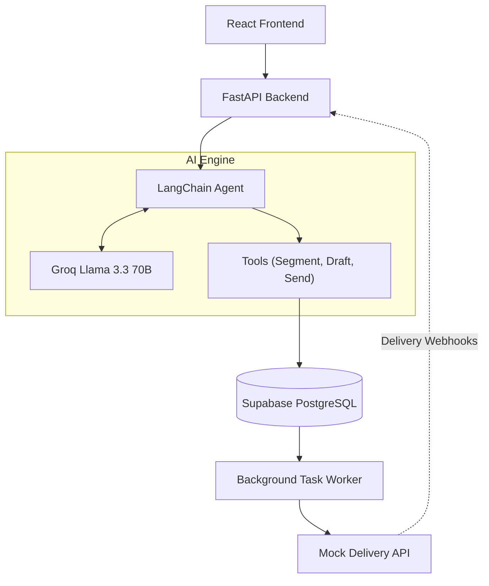

<div align="center">
  
  
  # XENO CRM 🚀
  
  **An AI-Native Mini CRM for Direct-to-Consumer Brands**
  
  [](https://react.dev/)
  [](https://fastapi.tiangolo.com/)
  [](https://python.langchain.com/)
  [](https://groq.com/)
  [](https://supabase.com/)

  *Built as a Take-Home Assignment for Xeno.*
</div>

---

## 📖 Overview

Xeno CRM rethinks marketing automation. Instead of manually filtering spreadsheets to find target audiences, marketers can simply chat with an AI Agent. The AI can segment customers, draft highly-converting, personalized multi-channel campaigns, and automatically dispatch them.

Our philosophy: **"Chat to Segment. Chat to Draft. Chat to Send."**

## ✨ Key Features

- 🧠 **AI-Powered Customer Segmentation**: Built with a LangChain Tool-Calling Agent and powered by Groq's blazing-fast Llama 3.3 70B model. Ask, *"Find all customers in Mumbai who haven't ordered in the last 30 days"* and the AI maps it directly into dynamic PostgreSQL queries via Supabase.
- ✍️ **Generative Campaign Copy**: The agent automatically drafts highly-converting, personalized marketing copy tailored to the targeted segment across WhatsApp, Email, and SMS.
- 🛡️ **"Human-in-the-Loop" Workflow**: The AI operates in a 3-step conversation (`Find` → `Draft` → `Send`), allowing marketers to review the audience size and the drafted copy before giving the final "Send" command.
- 📡 **Mock Dispatch & Tracking**: Once dispatched, campaigns are handed off to an asynchronous Channel Service (simulating providers like Twilio/SendGrid) with exponential backoff retries and webhook delivery callbacks (Delivered, Opened, Clicked).
- 🎨 **Premium Glassmorphic UI**: A stunning, responsive dark-mode dashboard built with React 19, Vite, Tailwind CSS, and Recharts.

---

## 🏗 System Architecture



---

## 🚀 Getting Started

### 1. Database Setup (Supabase)
Create a new Supabase project. You must initialize the database using the provided schema which creates tables for `customers`, `orders`, `campaigns`, and `communications`, as well as the required `exec_sql` RPC function for dynamic AI queries.

### 2. Backend & AI Agent Setup
The brain of the operation.
```bash
cd backend
python -m venv .venv
source .venv/bin/activate
pip install -r requirements.txt

# Create a .env file with your SUPABASE_URL, SUPABASE_KEY, and GROQ_API_KEY
uvicorn main:app --reload --port 8000
```

### 3. Channel Service (Mock Delivery)
The background microservice simulating Twilio/SendGrid.
```bash
cd channel-service
python -m venv .venv
source .venv/bin/activate
pip install -r requirements.txt
uvicorn main:app --reload --port 8001
```

### 4. Frontend Dashboard
The user interface.
```bash
cd frontend
npm install
npm run dev
```

---

## 🎯 Demo Workflow

To experience the full power of the AI CRM, follow this exact workflow:

1. Open the **AI Assistant** tab in the dashboard.
2. **Segment**: Type `Find all customers in Mumbai who haven't ordered in the last 30 days.` The AI will instantly query the DB and return the exact audience size and demographics.
3. **Draft**: Type `Draft a win-back campaign for them.` The AI will generate channel-specific, personalized marketing copy.
4. **Send**: Type `Looks great. Send it.`
5. **Track**: Navigate to the **Campaigns** tab to watch the delivery statuses (Sent, Delivered, Clicked) update in real-time as the Channel Service processes the webhooks!

---

<div align="center">
  <sub>Built with ❤️ by Harika</sub>
</div>
